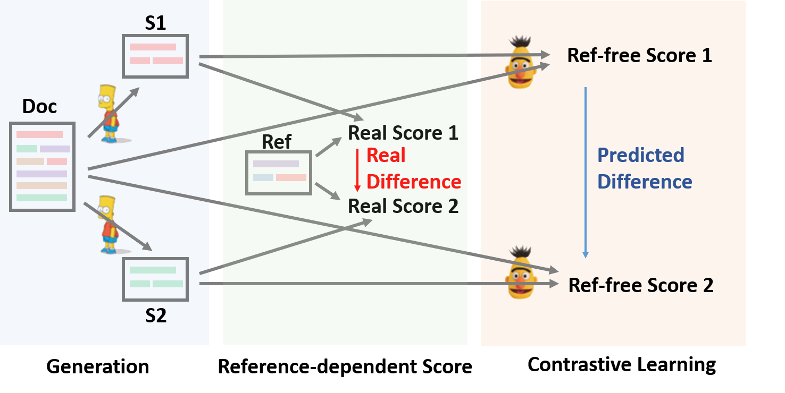
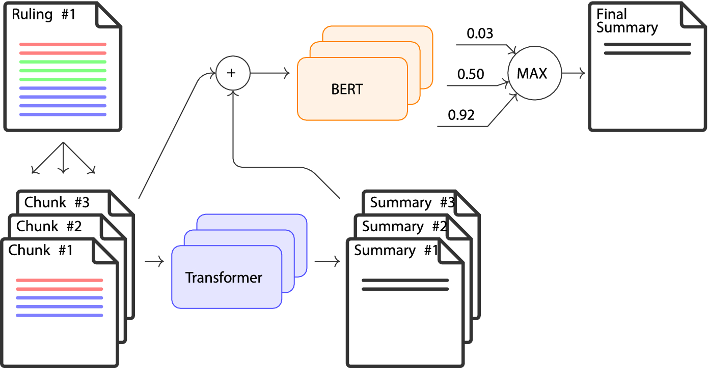
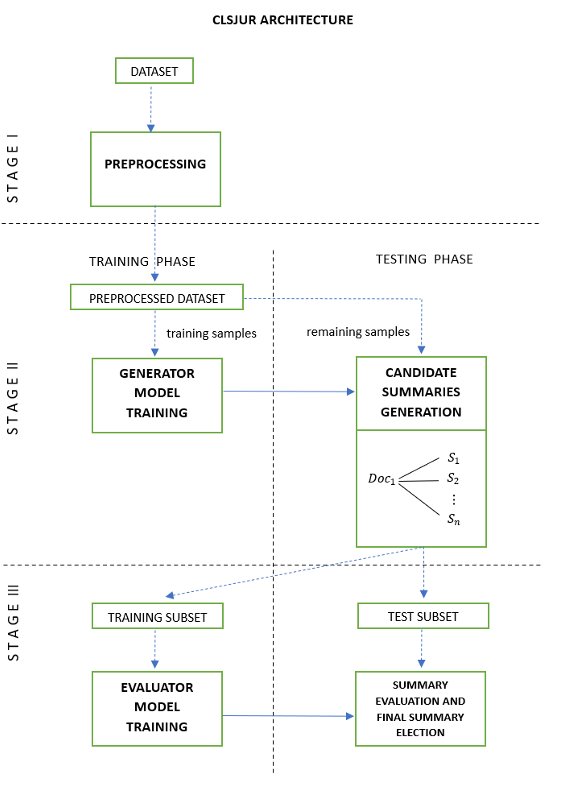
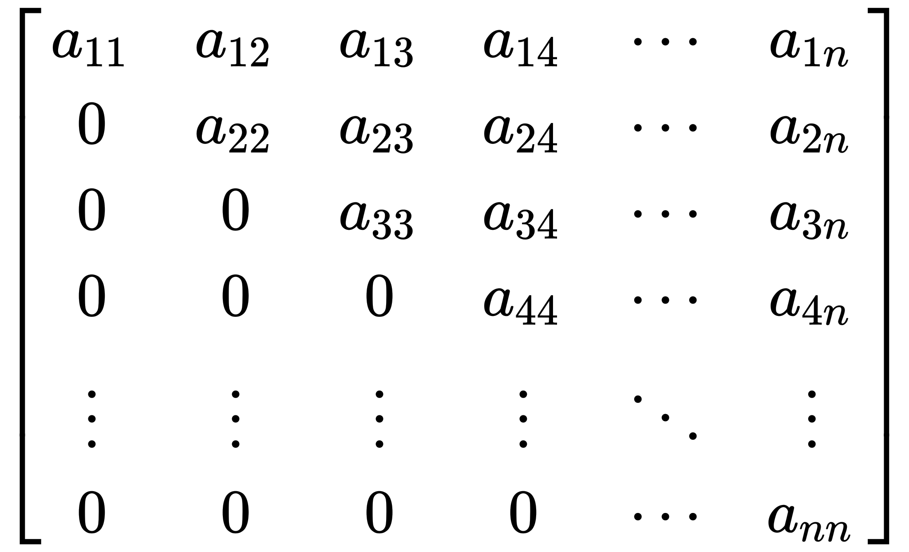

<!-- _class : invert -->
# :memo: Contrastive Learning for Text Summarization

:student: Por Giliard Godoi

---
<!-- paginate : true -->

## Compilado dos seguintes artigos

- Lins et al. (2024) **CLSJUR.BR: A Model for Abstractive Summarization of Legal Documents in Portuguese Language based on Contrastive Learning**.
- Feijó et al. (2023) **Improving abstractive summarization of legal rulings through textual entailment**.
- Liu et al. (2021) **SimCLS: A simple framework for Contrastive Learning of Abstractive Summarization**.

---
## Outros trabalhos semelhantes
- Zhang et al. (2024) **DCDSum: An interpretable extractive summarization framework based on contrastive learning method**.
- An et al. (2022) **CoLo: A Contrastive Learning based Re-ranking framework for One-Stage Summarization**.

---
<!-- _class : centering -->
## SimCLS framework

Source: Liu et al. (2021)

---
<!-- _class : centering -->
## Modelo de Feijó et al. (2023)

Source: Feijó et al. (2023)

---
<!-- _class : centering -->
## Modelo CLSJUR.BR

Source: Lins et al. (2024)

---
## O que esses modelos possuem em comum?
- Nos modelos de Aprendizado Profundo para sumarização o treinamento é feito considerando um tipo de função de perda, enquanto que a avaliação é feita considerando uma métrica como, por exemplo, ROUGE.

---
## Aprendizado por contraste

Definições:

- $D$ é o documento
- $\hat{S}$ é resumo de referência para esse documento
- $S = f(D)$ é a saída candidata onde a função $f$ é o modelo composto por:
    - $g(.)$ é o modelo de geração, treinado para maximizar a MLE
    - $h(.)$ é o função de avaliação que gera *scoring* de similaridade como, por exemplo, a distância cosseno.
- $m = M(S, \hat{S})$ é a métrica de avaliação, onde $M$ é a função de métrica
- $r_i = h(S_i, D)$ é o scoring atribuído ao sumário de referência $S_i$ em relação ao documento $D$

---
## Aprendizado por contraste
- O objetivo então é maximizar, ou escolher o sumário que apresenta o maior scoring de similaridade.
$$
S = \underset{S_i}{argmax} \quad h(S_i, D)
$$

---
## Aprendizado por contraste
- A função de custo é definida por:
$$
L = \underset{i}{\sum}\; max\left(0, h(D, \tilde{S_i}) - h(D, \hat{S})\right) \\
    +  \sum_{i}\sum_{j > i} \; max\left(0, h(D, \tilde{S}_j) - h(D, \tilde{S}_i) + \lambda_{ij} \right)
$$

- Onde $\tilde{S}_1,\;...\;,\tilde{S}_n$ são os sumários de referência em ordem decrescente segundo a métrica $M(\tilde{S}_i, \hat{S})$, e temos ainda o fator de margem
- $\lambda_{ij} = (j - i) * \lambda$ que é uma margem definido em um trabalho anterior e $\lambda$ é um hiper parâmetro do modelo.

---
## Aprendizado por contraste
- A função de custo é definida por:
$$
L = \underset{i}{\sum}\; max\left(0, h(D, \tilde{S_i}) - h(D, \hat{S})\right) \\
    +  \sum_{i}\sum_{j > i} \; max\left(0, h(D, \tilde{S}_j) - h(D, \tilde{S}_i) + \lambda_{ij} \right)
$$
- Na primeira parte da equação nós temos  a diferença entre a similaridade do sumário candidato e do sumário de referência em relação ao documento;
- Na segunda parte da equação nós temos um somatório da diferença da similaridade entre o sumário de referência $i$ e todos os demais sumários candidatos que são piores do que eles, em relação a métrica $M$.

---
<!-- _class : centering -->
## Aprendizado por contraste
- Pense nesse movimento de $j > i$ como produzindo uma matriz triangular superior.

- Portanto, essa equação está penalizando os sumários candidatos mais próximos da ordenação.

---
## Diferença entre os trabalhos
- Feijó et al. (2023) concebe o segundo módulo como um problema de *Textual Entailment*;
- Lins et al. (2024) segue a mesma linha metodológica de Liu et al. (2024) porém, testa diferentes modelos gerados, e diferente modelos discriminadores.

---
## Principais críticas a esses modelos

An et al. (2022) aponta que:
- Apesar dos módulos serem treinados de forma independente eles estão fortemente acoplados;
- O tempo de execução desses sistemas pode não ser viável para aplicações em cenários reais.

---
## Trabalhos futuros
- Incorporar a segmentação de documentos vista em Feijó et al. (2023) nos modelos do tipo CLS;
- Adaptar o sistema BRIO, dos mesmos autores de Liu et al. (2021), para o contexto jurídico.